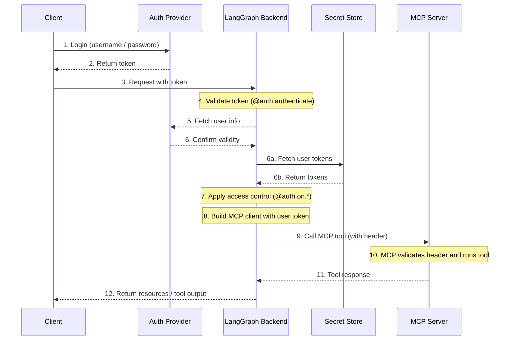

# 🔐 Agent Authentication On User Behalf

**Demonstrates proper user authentication patterns for LangGraph agents that interact with MCP servers on behalf of users.**

This repository implements the exact patterns from the [LangGraph Agent Authentication documentation](https://langchain-ai.github.io/langgraph/how-tos/auth/) showing how to:

1. **Implement custom authentication handlers**
2. **Access user credentials in graph nodes**  
3. **Authenticate with MCP servers using user tokens**
4. **Follow security best practices**

## 🎯 Problem Statement

Organizations need agents that can act on behalf of individual users to access external services (GitHub, Jira, etc.) through MCP servers. Common anti-patterns include:

- ❌ Storing user tokens in graph state (security risk)
- ❌ Using shared service accounts (no user attribution) 
- ❌ Manual token collection flows (poor UX)

## ✅ Solution: User-Scoped Authentication

This demo shows the **correct way** to implement user authentication that allows agents to act on behalf of specific users while maintaining security and proper attribution.

### Key Benefits

- 🔒 **Secure**: User tokens never stored in graph state
- 👤 **User-scoped**: Each request uses the authenticated user's credentials  
- 🚀 **Seamless**: No manual token collection required
- 📋 **Standards-based**: Follows LangGraph Platform authentication patterns

## 🏗️ Architecture



## 🚀 Quick Start

### 1. Authentication Handler

```python
from langgraph_sdk import Auth

auth = Auth()

@auth.authenticate
async def authenticate(headers: dict) -> Auth.types.MinimalUserDict:
    api_key = headers.get("x-api-key")
    if not api_key or not is_valid_key(api_key):
        raise Auth.exceptions.HTTPException(status_code=401, detail="Invalid API key")
    
    # Fetch user-specific tokens from your secret store
    user_tokens = await fetch_user_tokens(api_key)

    return {
        "identity": api_key,  # Required field
        "github_token": user_tokens.github_token,
        "email": user_tokens.email,
        "org_id": user_tokens.org_id
    }
```

### 2. Accessing User Config in Nodes

```python
def get_mcp_tools_node(state, config):
    # Access authenticated user (exact pattern from docs)
    user = config["configurable"].get("langgraph_auth_user")
    # e.g., user["github_token"], user["email"], etc.
    
    # Create MCP client with user's credentials
    client = MultiServerMCPClient({
        "github": {
            "transport": "streamable_http",
            "url": "https://api.githubcopilot.com/mcp/",
            "authorization_token": f"Bearer {user['github_token']}"
        }
    })
    
    tools = await client.get_tools()
    return {"tools": tools}
```

### 3. LangGraph Configuration

Update your `langgraph.json`:

```json
{
  "dependencies": ["."],
  "graphs": {
    "agent": "./agent.py:graph"
  },
  "env": ".env",
  "auth": {
    "path": "./auth.py:auth"
  }
}
```

## 🧪 Running the Demo

### Prerequisites

1. **GitHub Personal Access Token** with Copilot access
2. **Python 3.8+** with virtual environment

### Setup

```bash
# 1. Clone and setup
git clone <repo-url>
cd mcp-auth-demo
python -m venv .venv
source .venv/bin/activate  # Windows: .venv\Scripts\activate

# 2. Install dependencies  
pip install -r requirements.txt

# 3. Configure environment
cp .env.example .env
# Add your GitHub Personal Access Token to .env file

# 4. Run the demo
python main_demo.py
```

### Expected Output

```
🔐 Demonstrating LangGraph Authentication Pattern
📥 Incoming request: {'x-api-key': 'demo_api_key_123'}
✅ Authentication successful!
   Identity: demo_api_key_123
   Email: demo@example.com
   Has GitHub token: True

📡 Demonstrating MCP Tools Access
✅ User token retrieved from config['configurable']['langgraph_auth_user']
✅ MCP client created with user's GitHub token
✅ Connected to GitHub MCP server
```

## 📁 File Structure

```
mcp-auth-demo/
├── auth.py              # Custom authentication handler
├── agent.py             # LangGraph agent with MCP integration  
├── main_demo.py         # Standalone demo script
├── secret_management.py # User token storage
├── mcp_integration.py   # MCP client utilities
├── langgraph.json       # LangGraph Platform configuration
├── .env.example         # Environment variables template
└── README.md            # This file
```

## 🛡️ Security Best Practices

### ✅ DO

- Store tokens in secure secret management system
- Access user info via `config["configurable"]["langgraph_auth_user"]`
- Use HTTPS for all MCP communication
- Validate tokens before use
- Implement token refresh logic
- Log access patterns (not tokens)

### ❌ DON'T

- Store tokens in graph state (gets persisted)
- Pass tokens as parameters between nodes  
- Use shared service accounts
- Hardcode credentials
- Log sensitive authentication information

## 🚀 Deployment

### Local Development

```bash
langgraph dev --auth-config auth.py
```

### Production Deployment

```bash
langgraph deploy --name mcp-auth-demo
```

## 📋 MCP Transport Support

| Transport | Supports Auth | Use Case | Example |
|-----------|---------------|----------|---------|
| `streamable_http` | ✅ Yes | GitHub MCP Server | Most common |
| `sse` | ✅ Yes | Streaming APIs | Real-time data |
| `stdio` | ❌ No | Local processes | Use env vars |
| `grpc` | ❌ No | High performance | Use metadata |

## 🔗 References

- [LangGraph Platform Auth Overview](https://langchain-ai.github.io/langgraph/concepts/auth/)
- [Adding Custom Authentication](https://langchain-ai.github.io/langgraph/how-tos/auth/custom_auth/)
- [Using MCP in LangGraph](https://langchain-ai.github.io/langgraph/agents/mcp/)
- [GitHub MCP Server](https://github.com/github/github-mcp-server)

## 🤝 Support

For questions or issues:
- Review the [LangGraph authentication documentation](https://langchain-ai.github.io/langgraph/how-tos/auth/)
- Check the example code in this repository
- Open an issue for bugs or feature requests

---

**✨ Ready to implement secure, user-scoped agent authentication!** 🚀